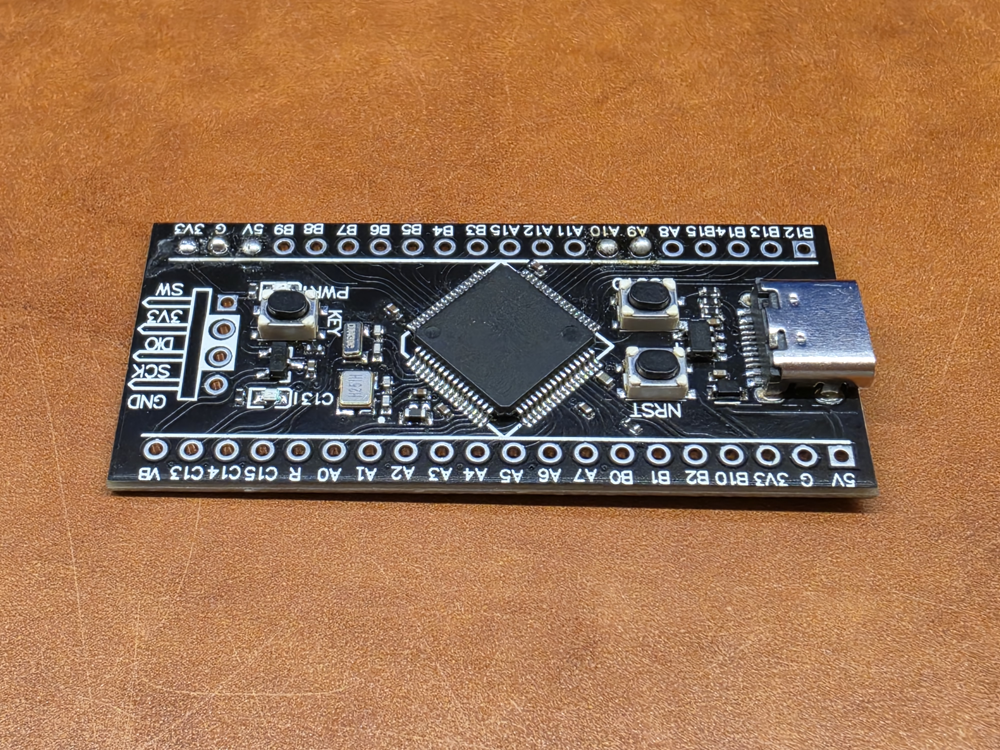
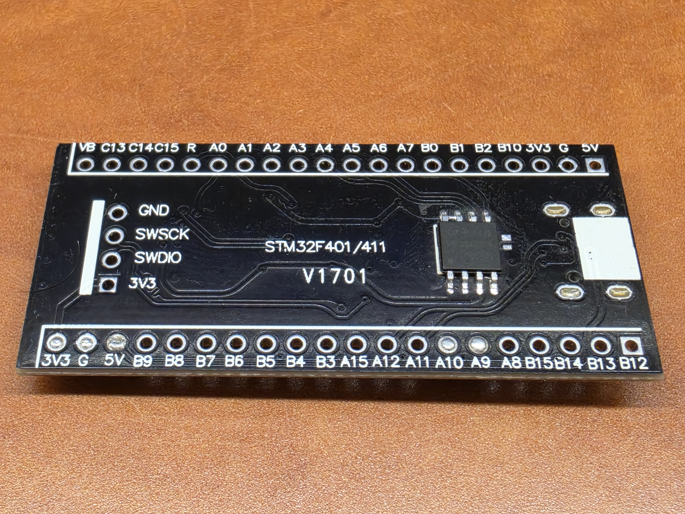
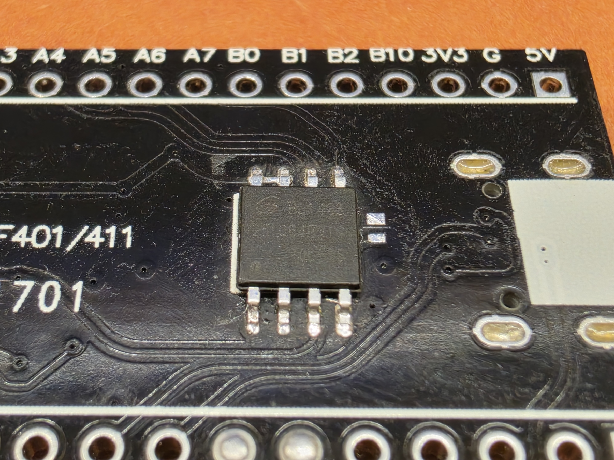
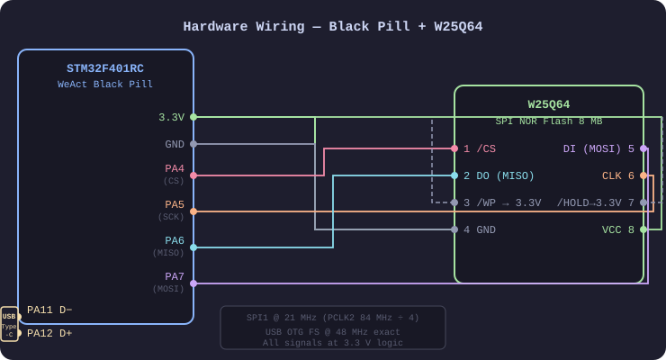
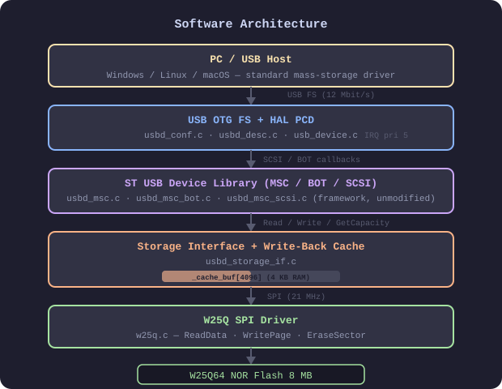
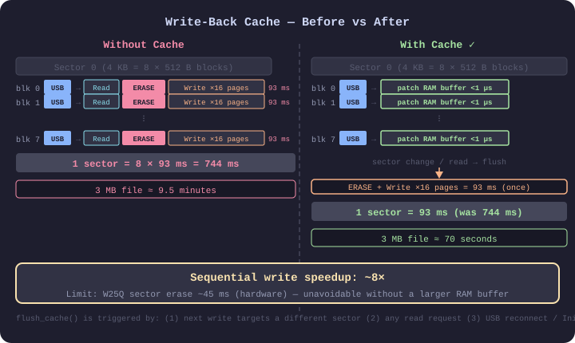
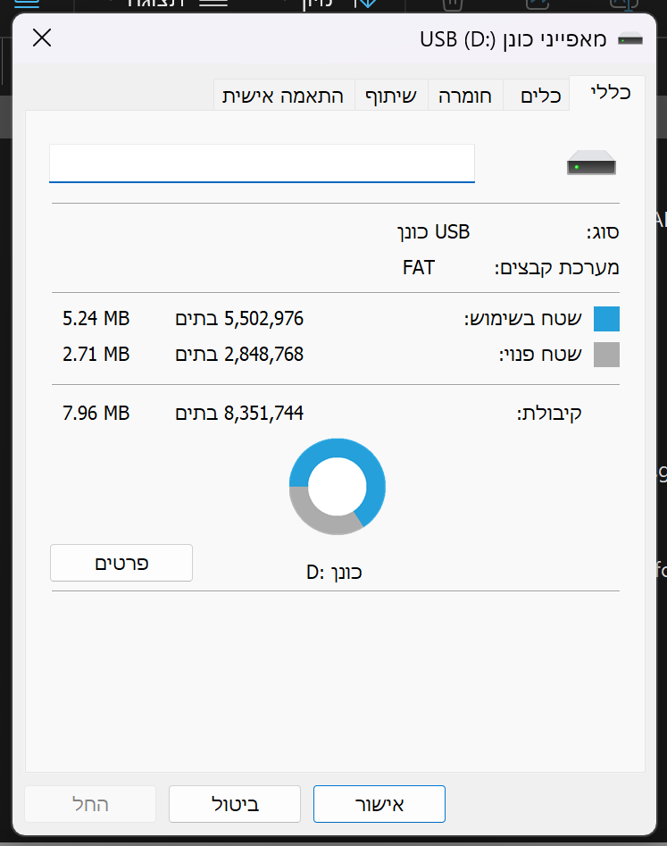
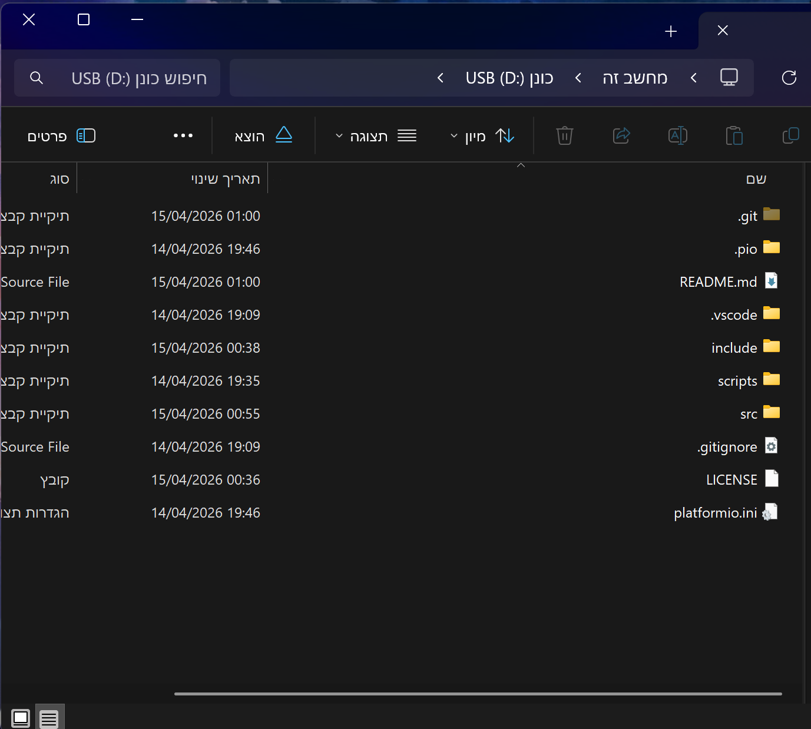
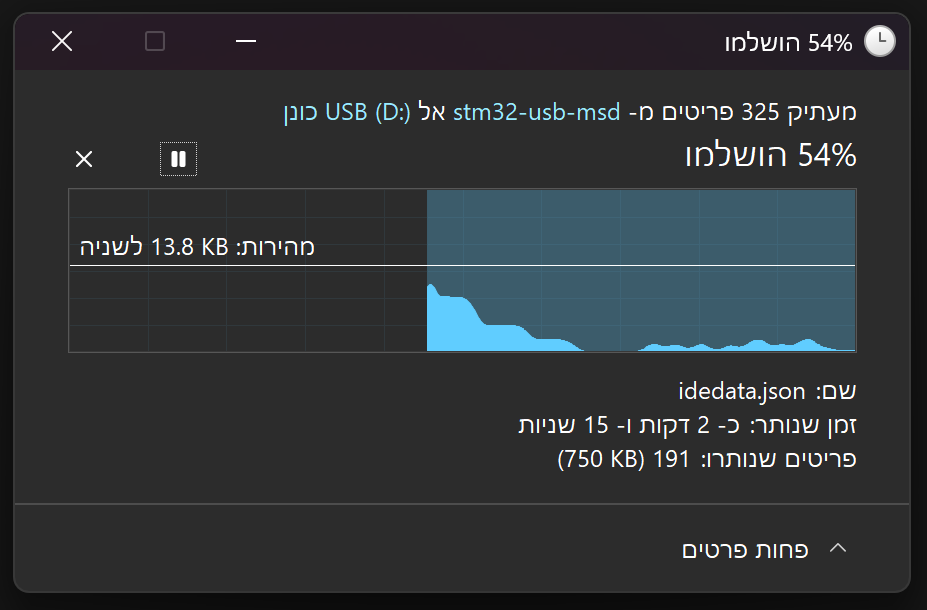

# STM32F401 USB Mass Storage — W25Q64 SPI Flash Drive

Bare-metal PlatformIO project that exposes an **8 MB W25Q64 SPI NOR Flash chip** as a standard USB Mass Storage Device (MSC/BOT/SCSI) on a **WeAct Black Pill** (STM32F401RC).

Plug the board into any PC and it appears as an 8 MB USB flash drive — no drivers needed.

---

## Hardware

| Signal | MCU pin | Notes |
|--------|---------|-------|
| USB D− | PA11 | USB OTG FS |
| USB D+ | PA12 | USB OTG FS |
| SPI SCK | PA5 | SPI1 |
| SPI MISO | PA6 | SPI1 |
| SPI MOSI | PA7 | SPI1 |
| Flash CS | PA4 | GPIO, active-low |
| LED | PC13 | Active-low (Black Pill built-in) |
| HSE crystal | — | 25 MHz (required for USB ±0.25 %) |

**Flash chip:** Winbond W25Q64 (8 MB, 4 KB sectors, 256 B pages)

| Front | Back |
|:---:|:---:|
|  |  |
| WeAct Black Pill STM32F401RC — USB Type-C, BOOT0 & NRST buttons | Back side — W25Q64 flash chip soldered in SOIC-8 package |


*W25Q64 — 8 MB SPI NOR flash, 8-pin SOIC package, soldered directly on the Black Pill PCB*

---



---

## Configuration

**One line** in [include/w25q.h](include/w25q.h) controls everything:

```c
#define FLASH_SIZE_MB  8U   // ← change this only
```

All other constants derive from it automatically — nothing else to touch:

| `FLASH_SIZE_MB` | Chip | USB drive size | SCSI blocks | Sectors |
|---|---|---|---|---|
| `1` | W25Q80 | 1 MB | 2,048 | 256 |
| `2` | W25Q16 | 2 MB | 4,096 | 512 |
| `4` | W25Q32 | 4 MB | 8,192 | 1,024 |
| **`8`** | **W25Q64** | **8 MB** | **16,384** | **2,048** |
| `16` | W25Q128 | 16 MB | 32,768 | 4,096 |

Page size (256 B) and sector size (4 KB) are identical across the entire W25Qxx family, so no other constant needs to change.

---

## Architecture



```
┌─────────────────────────────────────────────────────────┐
│                        main.c                           │
│  HAL_Init → Clock → GPIO → SPI → W25Q_Init → USB_Init  │
│  while(1): LED heartbeat (3 blinks + 800 ms pause)      │
└────────────────────────┬────────────────────────────────┘
                         │
          ┌──────────────▼──────────────┐
          │       USB OTG FS core       │
          │   usbd_conf.c / usbd_desc.c │
          │   PCD HAL ↔ USBD middleware │
          └──────────────┬──────────────┘
                         │  SCSI/BOT callbacks
          ┌──────────────▼──────────────┐
          │    usbd_storage_if.c        │
          │  Read / Write / GetCapacity │
          └──────────────┬──────────────┘
                         │
          ┌──────────────▼──────────────┐
          │          w25q.c             │
          │   SPI1 polling driver       │
          │  ReadData / WritePage /     │
          │  EraseSector / ReadID       │
          └─────────────────────────────┘
```

### Key source files

| File | Purpose |
|------|---------|
| `src/main.c` | Entry point — clock, peripherals, USB init, LED heartbeat |
| `src/usbd_conf.c` | USB HAL glue: PCD init, FIFO sizing, IRQ, static allocator |
| `src/usbd_desc.c` | USB descriptors (Device, Configuration, String) |
| `src/usb_device.c` | `MX_USB_DEVICE_Init()` — registers MSC class + storage callbacks |
| `src/usbd_storage_if.c` | SCSI storage backend: maps 512 B blocks to W25Q64 sectors |
| `src/w25q.c` | Low-level W25Q SPI driver (read / page-program / sector-erase) |
| `src/stm32f4xx_it.c` | SysTick_Handler + HardFault_Handler |
| `src/stm32f4xx_hal_msp.c` | SPI1 GPIO alternate-function init |
| `include/usbd_conf.h` | USBD middleware configuration macros |
| `include/stm32f4xx_hal_conf.h` | HAL module selection + SysTick priority |
| `scripts/usb_middleware.py` | PlatformIO pre-script: adds ST USB middleware to the build |

---

## Clock configuration

USB Full Speed requires the 48 MHz clock to be within **±0.25 %** — only an HSE crystal meets this tolerance.

```
HSE 25 MHz  →  PLL  →  SYSCLK 84 MHz,  USB 48.000 MHz (exact)

  VCO  = 25 / PLLM(25) × PLLN(336) = 336 MHz
  SYSCLK = VCO / PLLP(4)  = 84 MHz
  USB    = VCO / PLLQ(7)  = 48 MHz  ← exact, ±0 ppm from PLL
```

---

## USB stack

The project uses the **ST USB Device Library** (shipped inside `framework-stm32cubef4`) without any modification. A PlatformIO pre-script (`scripts/usb_middleware.py`) adds the Core and MSC source files to the build automatically.

### Static memory allocator

The USB MSC middleware calls `USBD_malloc` once to allocate `USBD_MSC_BOT_HandleTypeDef` (~628 bytes). Newlib-nano's default heap is only 512 bytes — not enough.

Solution: a simple 768-byte static pool defined in `usbd_conf.c`. No heap dependency, no fragmentation.

```c
#define USBD_MEM_SIZE 768U
static uint8_t usbd_mem_pool[USBD_MEM_SIZE];

void *USBD_static_malloc(uint32_t size) {
    if (size <= USBD_MEM_SIZE) {
        memset(usbd_mem_pool, 0, size);
        return usbd_mem_pool;
    }
    return NULL;
}
```

### USB descriptors

| Field | Value |
|-------|-------|
| VID | `0x0483` (STMicroelectronics) |
| PID | `0x5720` (Mass Storage) |
| Manufacturer | `STM32` |
| Product | `SPI Flash Drive` |
| Serial | Derived from STM32 UID (96-bit), UTF-16LE encoded |
| bcdUSB | 2.00 |
| Max packet (FS) | 64 bytes |

### FIFO layout (USB OTG FS, 1280 bytes total)

| FIFO | Size | Purpose |
|------|------|---------|
| RxFIFO | 512 B (0x80 words) | All OUT/SETUP traffic |
| TxFIFO EP0 | 256 B (0x40 words) | Control IN |
| TxFIFO EP1 | 512 B (0x80 words) | Bulk IN (MSC data) |

---

## Storage layer

### The NOR flash mismatch problem

NOR flash cannot overwrite existing data in place — a cell must be **erased before it can be written**, and the minimum erase unit is **4 KB**. USB/SCSI, on the other hand, works in **512 B blocks**. Bridging this gap requires a read-modify-write cycle every time a block is written.

The SCSI layer always delivers **exactly one 512 B block per `STORAGE_Write_FS` call** (limited by the 512 B USB bulk endpoint buffer). A naïve implementation that erases the full sector on every call hits a painful edge case: 8 consecutive blocks in the same 4 KB sector erase it **8 separate times**:

```
call 1 → block 0 in sector 0: read 4 KB → erase → write 16 pages = ~93 ms
call 2 → block 1 in sector 0: read 4 KB → erase → write 16 pages = ~93 ms  ← same sector again!
...
call 8 → block 7 in sector 0: read 4 KB → erase → write 16 pages = ~93 ms  ← 8th redundant erase
```

For a 3 MB file: **6,144 calls × 93 ms ≈ 9.5 minutes**. Unusable.

### Write-back sector cache

`usbd_storage_if.c` solves this with a one-sector write-back cache:

```
┌─────────────────────────────────────────────────────────┐
│              _cache_buf[4096]  +  _cached_sector         │
└──────────────────────────┬──────────────────────────────┘
                           │
  STORAGE_Write_FS(blk)    │   STORAGE_Read_FS(blk)
         │                 │           │
  same sector?             │    flush_cache()
    ├─ YES → patch RAM ────┤      then read flash
    └─ NO  → flush_cache() │
             load new sector│
             patch RAM      │
```

**Rules:**
1. Incoming 512 B block → patch it into `_cache_buf` in RAM. **No flash access.**
2. When the *next* write is for a **different** sector → `flush_cache()`: erase the old sector, write all 16 pages back, then load the new sector.
3. When a **read** arrives → `flush_cache()` first (so flash contains the latest data), then read flash normally.
4. On USB **reconnect / init** → `flush_cache()` (commits any pending sector from the previous session).

Result: each 4 KB sector is erased and written exactly **once**, regardless of how many of its 8 blocks were modified.



### Performance comparison

| Scenario | Without cache | With cache |
|---|---|---|
| Write 1 block to a sector | 93 ms | 93 ms (first cross to new sector) |
| Write all 8 blocks of a sector | 8 × 93 ms = **744 ms** | **93 ms** |
| Write 3 MB sequentially | ~9.5 min | ~70 s |
| Write speedup (sequential) | 1× | **~8×** |

The remaining bottleneck is the W25Q sector erase time (~45 ms typical) — a hardware limit that cannot be avoided without a larger RAM buffer or a different flash family.

### Flash geometry

| Parameter | Value |
|-----------|-------|
| Capacity | set by `FLASH_SIZE_MB` (default 8 MB) |
| SCSI blocks | `FLASH_SIZE_MB × 2048` blocks of 512 B |
| Sector size | 4,096 B (erase unit — same for all W25Qxx) |
| Page size | 256 B (write unit — same for all W25Qxx) |
| SPI clock | 21 MHz (PCLK2 84 MHz ÷ 4) |
| Typical sector erase | ~45 ms |
| Typical page write | ~3 ms |

---

## LED behaviour

The built-in LED on **PC13** is **active-low**: the GPIO being LOW turns the LED ON, HIGH turns it OFF.

### Normal boot sequence

```
Power on
    │
    ▼
[HAL + Clock init]  ── LED turns ON immediately after clock is ready
    │
    ▼
[GPIO / SPI / W25Q / USB init]  ── LED stays solid ON during all init
    │
    ▼
[Main loop]  ── heartbeat pattern starts
```

### Heartbeat pattern (normal operation)

Once init is complete the firmware enters an infinite loop that produces this repeating pattern:

```
      120ms 120ms 120ms 120ms 120ms 120ms       800ms
LED: ▁▁▁▁▁▁█████▁▁▁▁▁▁█████▁▁▁▁▁▁█████████████████████ ...repeat
      blink 1    blink 2    blink 3    long ON pause
      └───────────────── 1520 ms total ──────────────────┘
```

- **3 brief OFF-pulses** (120 ms each), LED on between them
- **800 ms solid ON** after the 3rd pulse
- Whole cycle repeats every **~1.5 seconds**

This pattern means: *firmware is alive, USB stack is running, waiting for a host to connect.* The LED stays in this loop whether or not a USB cable is plugged in — USB traffic is handled by interrupts in the background.

### Error patterns

| What you see | Source | Meaning |
|---|---|---|
| Solid ON forever (no blinking) | Boot stuck | Clock / PLL failed before LED init, or HAL_Delay is hanging |
| LED goes OFF and stays OFF | Old firmware without HardFault handler | Should not happen with current code |
| **Very rapid flicker** (~100 Hz, looks dim/solid) | `HardFault_Handler` | Firmware crashed — null pointer, stack overflow, bad memory access |
| **Fast blink** (~15 Hz, clearly visible) | `Error_Handler` | HAL peripheral init failed (SPI, RCC, etc.) |

#### How to tell fast from very-rapid

- **~15 Hz (Error_Handler):** clearly visible ON/OFF alternation, like a distress strobe
- **~100 Hz (HardFault):** LED appears dimmed or "wrong brightness" rather than blinking — above the eye's flicker-fusion threshold

#### Why the LED is not USB-aware

The heartbeat loop runs on the main thread. USB data transfers happen entirely inside the USB OTG interrupt (priority 5). The main loop never blocks or yields for USB, so the blink pattern is the same whether the drive is idle or being written to. There is intentionally no "USB active" LED indicator — adding one would require a flag set inside the ISR and read in the main loop.

---

## It works

Once flashed, Windows recognises the board as a standard 8 MB USB drive with no drivers required.

### Drive recognised by Windows

| Drive properties | Explorer |
|:---:|:---:|
|  |  |
| FAT filesystem, 7.96 MB capacity — identical to any USB stick | Project files copied to the flash and browsable in Explorer |

### File transfer in progress


*Copying 325 files to the flash drive at ~13.8 KB/s — write speed is bounded by the W25Q sector erase time (~45 ms per 4 KB), not the USB bus.*

---

## Building & flashing

### Requirements
- [PlatformIO](https://platformio.org/) (VS Code extension or CLI)
- `dfu-util` (installed automatically by PlatformIO)
- STM32F401RC Black Pill board with W25Q64 wired as shown above

### Build
```bash
pio run
```

### Flash (DFU bootloader)
1. Hold **BOOT0** on the Black Pill
2. Tap **RESET**
3. Release **BOOT0**
4. Run:
```bash
pio run -t upload
```

---

## Known design notes & gotchas

### SysTick priority must be 0 (highest)
`TICK_INT_PRIORITY = 0x00U` in `stm32f4xx_hal_conf.h`. The USB ISR runs at priority 5. SysTick must be able to preempt it, otherwise `HAL_Delay()` deadlocks inside USB callbacks.

### `SysTick_Handler` must be in your project
STM32Cube projects require `SysTick_Handler` calling `HAL_IncTick()` in `stm32f4xx_it.c`. Without it, `uwTick` never increments and every `HAL_Delay()` hangs forever.

### Serial string descriptor buffer size
`IntToUnicode()` writes **2 bytes per nibble** (UTF-16LE). The UID serial uses 20 nibbles = 40 bytes. The local buffer must be `uint8_t serial[40]`, not 24 — a 24-byte buffer overflows the stack and causes a HardFault during USB enumeration (when Windows requests string descriptor #3).

### Write performance is bounded by flash erase time
Sequential write throughput peaks at ~4 KB / 93 ms ≈ **44 KB/s**. This is a hardware limit — W25Q sector erase takes ~45 ms and cannot be parallelised or skipped. A 3 MB file takes roughly 70 seconds. Reads are much faster (~2.5 MB/s raw SPI bandwidth).

### HSI cannot be used for USB
The internal RC oscillator (HSI 16 MHz) has ±1 % tolerance — 4× worse than USB FS requires. Always use the HSE crystal for the USB clock source.

---

## License

Licensed under the [Apache License 2.0](LICENSE).
